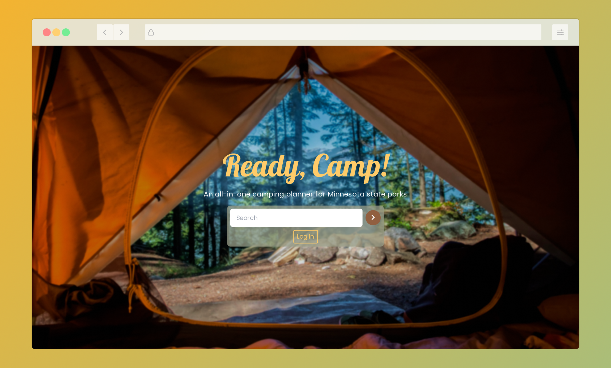

# Ready, Camp! :camping:
> An all-in-one camping planner lets users efficiently plan camping trips in Minnesota. Simply look up your favorite state park and start planning.


### :movie_camera: [Demo Video](https://youtu.be/j0Zeby7WSCg)

## Prerequisites

- NodeJS and Yarn package manager.
- Latest version of Python and Pip3.
- PostgresQL database named "state_parks".
- A [Mapbox API public token](https://account.mapbox.com/auth/signup/).
- A [ClimaCell API key](https://developer.climacell.co/sign-up).

## Installation

React frontend:
```
$ yarn install
```

Create a virtual environment:
```
$ python3 -m venv venv
$ source venv/bin/activate
```

Flask backend:
```
$ pip3 install -r requirements.txt
```

Initialize database:
```
$ psql state_parks < data/state_parks.sql
```

Create a ".flaskenv" file in the root directory with these contents:
```
FLASK_ENV=development
FLASK_APP="app.py"
```

Create a ".env" file in the root directory with these contents:
```
NODE_ENV=development
DB_URI="postgresql:///state_parks"
TEST_DB_URI="postgresql:///test_state_parks"
MAPBOX_TOKEN=<insert your mapbox token here>
CLIMACELL_KEY=<insert your climacell key here>
SECRET_KEY=<insert a generated secret key here>
```

## Usage

Bundle the assets (you only need to build the bundle once) and start the server:
```
$ mkdir static
$ yarn build
$ flask run
```
Navigate to localhost:5000.

To test the backend API:
```
$ createdb test_state_parks
$ psql test_state_parks < data/state_parks.sql
$ python3 tests.py
```

## Project Proposal

### Overview

Ready, Camp! is an all-in-one camping planner that allows users to plan camping trips for Minnesota State Parks. Each parks page lets users view the current weather and get navigation details via interactive maps. Users will be able to see important parks details such as address, what it is known for (e.g. hiking, bird watching), and a URL that will direct the user to the original DNR park website. A recommended camping checklist on each page helps users organize their packing better. Users with registered accounts can favorite parks and have their checkmarks saved between sessions.

### Technologies used

- React
- Flask
- BeautifulSoup
- Selenium
- Webpack v5
- Babel
- twin.macro (Babel macro for TailwindCSS)
- Emotion (CSS-in-JS library)
- React Router
- React Helmet
- React Hook Form
- React Toastify
- PyJWT
- Font Awesome
- Axios

### 3rd Party APIs

- Mapbox
- ClimaCell

### Data

- Minnesota State Parks
- Users
- Favorite parks
- Camping items
- JWT blacklist

### Roadmap

#### MVP :white_check_mark:

- Look up any Minnesota state park and view relevant info
- Maps with direction capability
- Current weather report

#### 2.0 :white_check_mark:

- Park pages have a recommended camping checklist
- Users can regsiter an account
- Users can favorite parks
- Users can checkmark items (persisted data)

#### 3.0

- Search page for parks (view all, or through search query)
- Image carousel per park
- Expanded weather widget with 15 day forecast

### Deployment

Soon! :rocket:

### DevOp Goals

- NGINX deployment
- Docker and Kubernetes implementation
- Travis CI/CD
- Frontend Jest testing

### Notes

Given the potential of this project, there are plans to reach all the state parks in the USA, as well as additional features such as item customization, weather forecasting, and dynamic recommendations.
